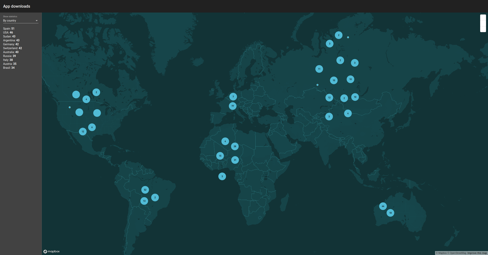
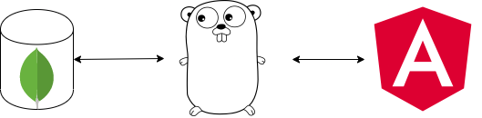

# Real time app download visualization

The aim of this project is to show a world map dashboard containing app downloads information.
Every time a download is performed, the dashboard should update automatically.



## Technologies
The technologies used are the following:
- MongoDB for the persistence using the changestreams feature for real time updates
- Go backend server, without dependencies (except for the mongodb driver)
- An Angular Frontend Application
The backend server pushes changes to the frontend application using a web socket


## Prerequisites
bash
docker-compose 

## Run the app

### With Docker
The easiest way to run the whole app is to run the run script
```bash
./run.sh
```

This will spin up all the necessary containers (mongodb, the server app, the angular app) by using docker compose.
Additionally it will take care of setting up mongodb as a replicaset, which is needed in order to have [change streams ](https://www.mongodb.com/blog/post/an-introduction-to-change-streams)

### Run the server on local machine
You need golang 1:14 for this.
Go to server, and execute the following commands
```bash
go mod download
go run main.go
```

### Run the Angular app on local machine
For this you would need npm.
Go to frontend, and execute the following command:
```bash
npm run start
```
